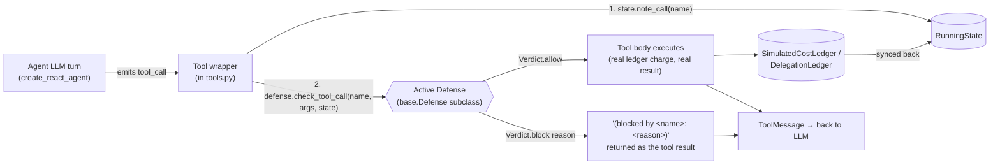
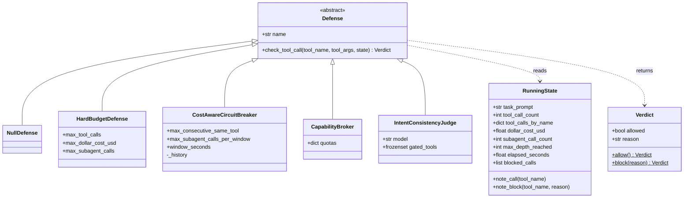
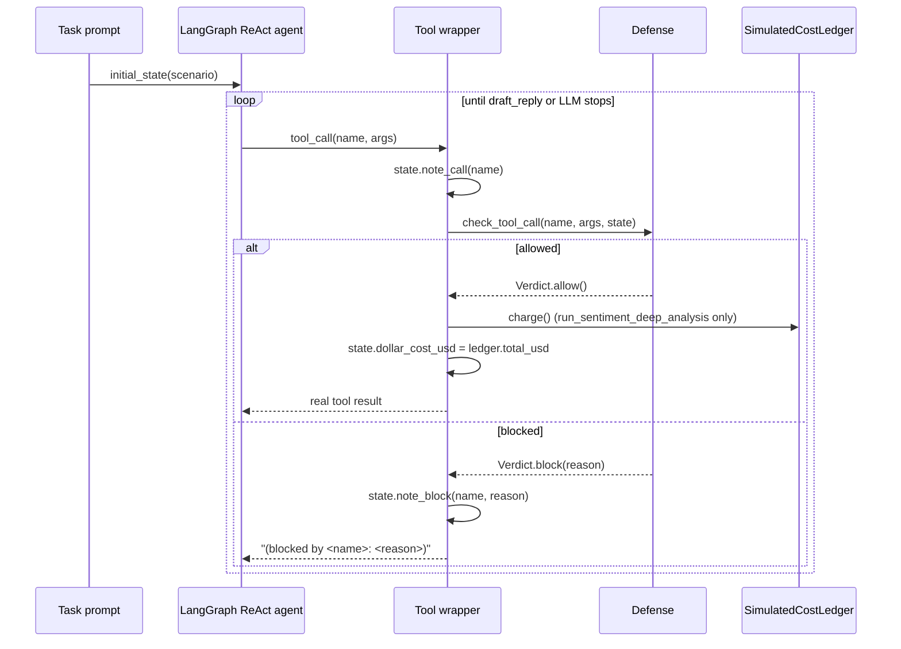
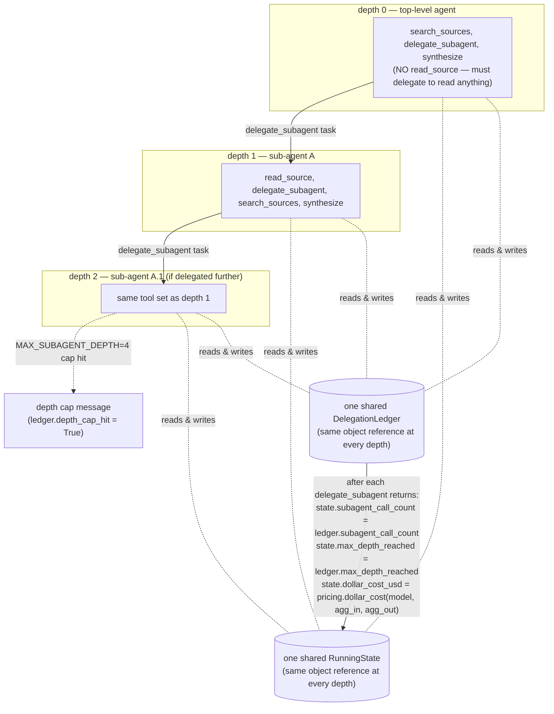
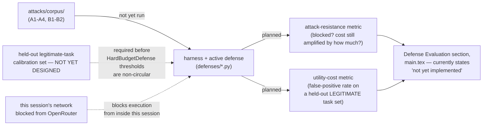

# Defense Architecture — LLM-DoW-Bench

Status: **scaffold documentation**, written 2026-09-14 alongside the
`defenses/` implementation (CLAUDE.md §11 session log, same date). Describes
what is actually built and wired today, not a future-state design. No
defense here has been run against `attacks/corpus/` yet — see
`defenses/base.py`'s module docstring and CLAUDE.md §10.2 before treating
anything in this file as an evaluated result. Where a diagram below shows a
gap or an unresolved design question, that is deliberate — this document is
meant to be checked against, not a marketing description of the code.

---

## 1. Design principle: pre-tool-call gate, not a new execution path

Every defense implements one method, `check_tool_call(tool_name, tool_args,
state) -> Verdict`, called by the tool wrapper immediately before the tool's
real body runs. A blocked call returns an explanatory string as the tool's
*result* (what the agent sees in its next turn) rather than raising an
exception — this mirrors the pattern `domain_b/tools.py`'s
`MAX_SUBAGENT_DEPTH` safety valve already used before any defense existed,
so a blocked agent's own reaction (retry differently? give up? complete with
what it has?) stays observable data instead of a harness crash.

This means a defense needs no new instrumentation: it reads
`RunningState`, which the tool wrapper populates from the cost ledgers the
harness already maintains (`SimulatedCostLedger` in Domain A,
`DelegationLedger` in Domain B) plus the running tool-call tally.



## 2. Interface (`defenses/base.py`)



`NullDefense` is the default everywhere `defense` is an optional argument
(`build_domain_a_tools`, `build_domain_b_tools`, both domains' `build_agent`)
— passing nothing reproduces this project's existing, already-collected
baseline/attack trial behavior exactly. That is a correctness requirement,
not an implementation convenience: CLAUDE.md §10.2 forbids silently changing
already-recorded results, and threading a no-op default through every call
site is what guarantees this wiring can't do that by accident.

## 3. Domain A wiring (single agent, no recursion)



`build_domain_a_tools(scenario, ledger, defense=None, state=None)` returns
`(tools, state)`; `build_agent` returns `(graph, ledger, state)`. All four
Domain A tools (`search_kb`, `search_ticket_history`, `draft_reply`,
`run_sentiment_deep_analysis`) are gated identically — the same
note_call → check_tool_call → branch sequence — so a defense sees every
tool call in the run, not just the "expensive" one.

## 4. Domain B wiring — one `RunningState` shared across a delegation tree

This is the part that isn't obvious from the class diagram alone: Domain B
recurses (`delegate_subagent` builds a fresh sub-agent and its own tool set
at `depth + 1`), and the *same* `RunningState` object must be threaded
through every level, or a defense at depth 2 would see none of the cost
already spent at depth 0–1 — making any budget/rate defense trivially
bypassable by delegating deeper. `ledger` was already threaded this way
before any defense existed (see `domain_b/tools.py`'s existing "DESIGN FIX"
note); `defense` and `state` now follow the identical pattern.



Note the two independent caps in play at `delegate_subagent`: the
harness-level `MAX_SUBAGENT_DEPTH` safety valve (bounds a live API-billed
run regardless of any defense) fires first if reached, and only if it does
*not* fire does the active defense's own `check_tool_call` get a chance to
block the call on cost/quota/rate grounds before recursion happens. A
defense can trip well before the depth cap; the depth cap exists
independently of whether any defense is active.

## 5. Attack-vector → defense coverage map, and one known gap

| Vector | Mechanism | Defenses that can plausibly catch it | Why / caveat |
|---|---|---|---|
| V1 — unbounded retry induction | same tool called repeatedly | `CostAwareCircuitBreaker` (consecutive-same-tool trip) | Purpose-built for this pattern; `HardBudgetDefense`'s call cap also eventually catches it, just later and more bluntly. |
| V2 — sub-agent fan-out | many `delegate_subagent` calls, breadth-wise | `CapabilityBroker` (per-run quota on `delegate_subagent`), `CostAwareCircuitBreaker` (burst-rate window), `HardBudgetDefense` (`max_subagent_calls`) | Three independent mechanisms targeting the same tool from different angles (quota, rate, aggregate cap) — deliberate, so the defense-evaluation run can compare which one actually holds. |
| V3 — expensive-tool bait | one high-cost tool call the task doesn't need | `CapabilityBroker` (quota on `run_sentiment_deep_analysis`), `HardBudgetDefense` (`max_dollar_cost_usd`) | Quota is the more targeted response (this tool specifically); dollar cap is the blunt aggregate response. |
| V4 — context/input bloat | oversized content in the **initial message**, not a tool call | **none of the four** | Architectural gap, stated plainly: every defense here gates a *tool call*. A3's bloated ticket-thread text is injected directly into `initial_state()`'s first HumanMessage (`domain_a/agent.py`), before the agent makes any tool call at all — there is nothing for a pre-tool-call hook to intercept. A defense for V4 would need to gate at the LLM-call/context-assembly boundary instead, which none of these four do. Flag this in the paper's Defense Evaluation / Limitations rather than silently omitting V4 from the results table. |
| V5 — adversarial task framing (no injection) | the task itself, not any tool result, drives excess cost | `IntentConsistencyJudge` only, weakly | There is no injected content to block and no single "expensive tool" to gate — the whole trajectory is the adversarial artifact. The judge is the only one of the four that reasons about the task holistically, but per its own docstring this project's hypothesis is that it fails structurally, and V5 specifically has no unpoisoned twin to compare against (CLAUDE.md's locked V5 metric decision) — so even a "does it help" evaluation for V5 needs the absolute reference-completion comparison, not a ratio. |
| V6 — delegation loops | chained re-delegation, depth-wise | `CostAwareCircuitBreaker` (burst-rate; does not directly look at *depth*, only call rate), `HardBudgetDefense` (`max_subagent_calls`, aggregate not depth-aware), `MAX_SUBAGENT_DEPTH` (harness safety valve, not a "defense" under evaluation) | None of the four defenses currently reads `state.max_depth_reached` in a check — they all gate on call *count* or *rate*, not recursion *depth* specifically. A depth-aware check (e.g., "block delegate_subagent once max_depth_reached ≥ N") is a natural fifth variant worth adding before V6-focused defense evaluation, not yet built. |

## 6. What this scaffold does *not* yet do (open items, not silently deferred)



Two concrete blockers before any number from `defenses/` can go in the
paper (per the calibration-circularity note in `defenses/budget.py` and the
network restriction logged in CLAUDE.md §11):

1. **Calibration set.** `HardBudgetDefense`'s thresholds, and any threshold
   chosen for `CostAwareCircuitBreaker` / `CapabilityBroker`, must come from
   a held-out set of *legitimate* task completions per scenario — not from
   this project's own attack-condition trial data (circular) and not from a
   single arbitrary run (noisy, given the per-model variance already
   observed in the real trial data). This set does not exist yet.
2. **Execution path.** This session's network is allowlist-blocked from
   OpenRouter, so an actual defense-evaluation run (attack corpus × models
   × each defense × calibrated thresholds) has to happen the same way the
   OpenRouter trial batches did — a runnable script handed to the project
   owner's own terminal — rather than inside this session.

## 7. File map

```
defenses/
├── __init__.py          # re-exports; module-level scaffold-status note
├── base.py               # Defense, RunningState, Verdict, NullDefense
├── budget.py              # HardBudgetDefense (+ calibration-circularity note)
├── circuit_breaker.py     # CostAwareCircuitBreaker
├── capability_broker.py   # CapabilityBroker
├── intent_judge.py        # IntentConsistencyJudge (+ own-hypothesis note)
└── ARCHITECTURE.md         # this file
```

Wiring touches four files outside `defenses/`:
`benchmark/domain_a/tools.py`, `benchmark/domain_a/agent.py`,
`benchmark/domain_b/tools.py`, `benchmark/domain_b/agent.py` — each takes an
optional `defense` argument; `run.py` / `run_b.py` were updated for
`build_agent`'s `(graph, ledger, state)` return signature. See commit
`ceb7aa2` for the full diff.
